# ForeSee AI - Prodüktivite ve Yapay Zeka Platformu

## Geliştirici Bilgileri

- **Geliştirici:** [Yusuf7788-Y](https://github.com/yusuf7788-Y)

---

> [!CAUTION]
> **ÖNEMLİ LİSANS VE İSİMLENDİRME UYARISI:**
> Bu projeyi çatallayacak (fork) veya kullanacak kişiler **"ForeSee"**, **"Ufine"**, **"ForWeb"**, **"ForeWeb"** gibi isimleri ve logoları kullanamazlar. Bu isimler ticari haklara tabidir ve lisans gereği değiştirilmesi zorunludur. Ayrıca uygulamanın kullandığı `.fsa` dosya uzantısını da kendi projenizde kullanmamanız, değiştirmeniz gerekmektedir.

## Proje Hakkında

**ForeSee**, Ufine çatısı altında geliştirilmiş, üretkenliği ve yapay zeka deneyimini tek bir çatı altında toplayan kapsamlı bir platformdur.

**Dikkat: Bu depo (repository) içerisindeki kodlar "Olduğu Gibi" paylaşılmıştır.**

### Bilmeniz Gerekenler

- **Profesyonellik:** Kod yapısı yer yer karmaşık olabilir ve temiz kod (clean code) prensiplerine her zaman sadık kalınmamıştır (Çoğunlukla kalınmamıştır.). Mobil kullanıcılar için kurcalanmadığı sürece stabil çalışmaktadır.
- **AI Tarafından Yazılmış Kod:** Projenin büyük bir kısmı AI Agent'lar (yapay zeka asistanları) yardımıyla geliştirilmiştir. Eğer kodlama konusunda uzman değilseniz, geliştirmelere bir AI asistanı ile devam etmeniz önerilir.
- **Ölü Kodlar:** Proje içerisinde kullanılmayan paketler (packages), ölü kod blokları ve dosya kalıntıları bulunabilir.
- **Proje Boyutu:** Proje dosyaları ve varlıkları (assets) ile birlikte yaklaşık **1.7GB** civarındadır.
- **Uygulama Boyutu:** Yaklaşık **100MB** civarındadır. (Verisiz APK dosyası örnek alınmıştır.)
- **İşlevsellik:** Repo içerisindeki AI özellikleri, geçerli bir API anahtarı girilmediği sürece çalışmamaktadır. Mevcut APK dosyasındaki AI özellikleri de aktif değildir.
- **Dil** Uygulama tamamen Türkçe olarak tasarlanmıştır.

## Kurulum ve Çalıştırma

### 1. Gereksinimler

- Flutter SDK (En güncel sürüm önerilir)
- Dart SDK
- Android Studio / VS Code

### 2. Ortak Değişkenler (.env)

Proje kök dizininde bir `.env` dosyası gerektirir. Örnek yapı için `.env.example` dosyasını inceleyin.

```bash
cp .env.example .env
```

Ardından içindeki API anahtarlarını (OpenRouter, ElevenLabs vb.) kendi anahtarlarınızla doldurun.

### 3. Uygulamayı Başlatma

```bash
flutter clean
flutter pub get
flutter run
```

Veya

```bash
flutter clean; flutter pub get; flutter run
```

## Ekran Görüntüleri

### 🌙 Dark Mode

````carousel
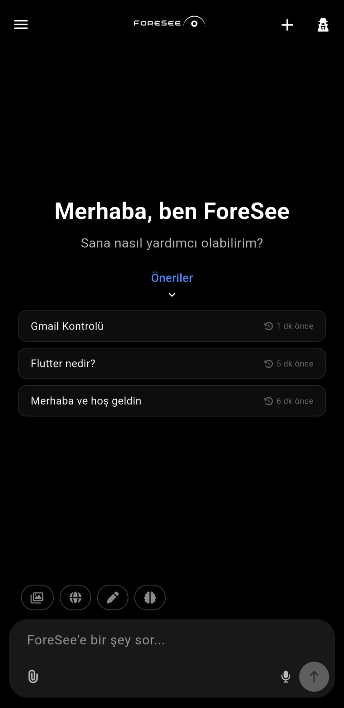
<!-- slide -->
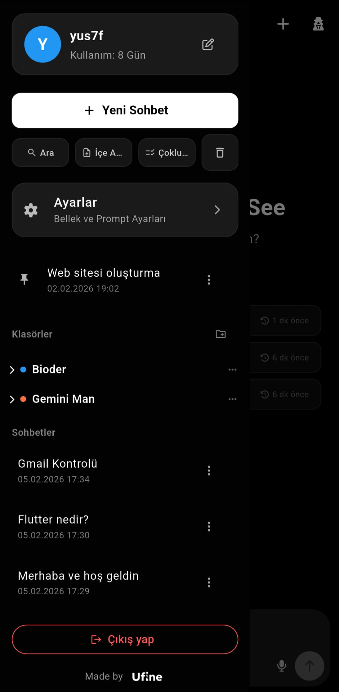
<!-- slide -->
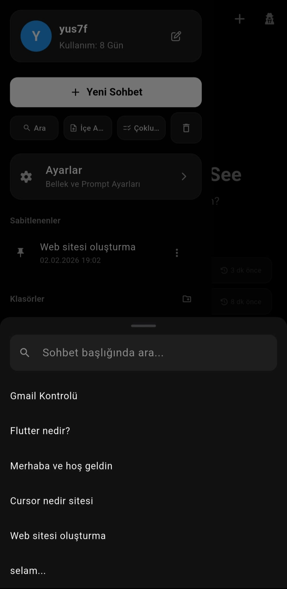
<!-- slide -->
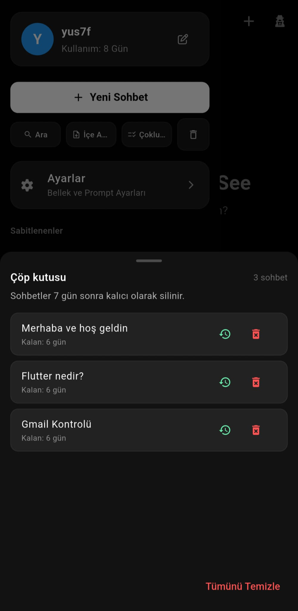
<!-- slide -->
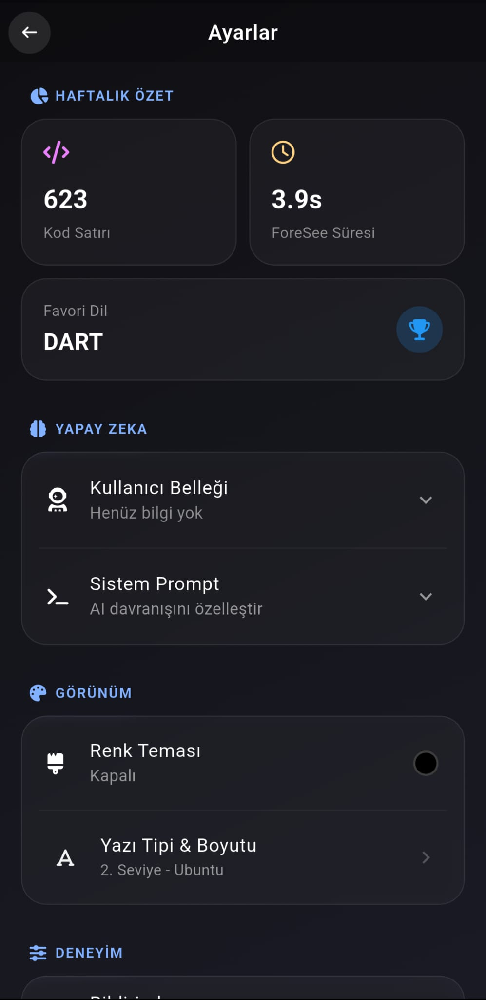
<!-- slide -->
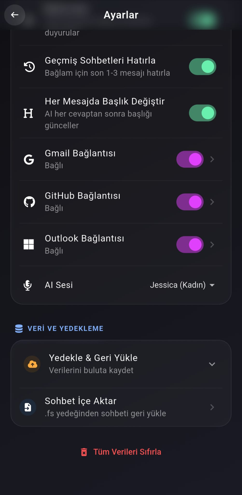
````

### ☀️ Light Mode

````carousel

<!-- slide -->
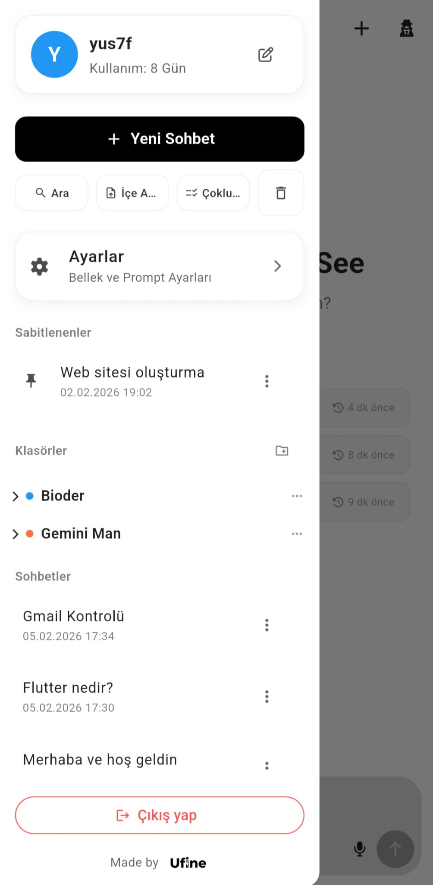
<!-- slide -->
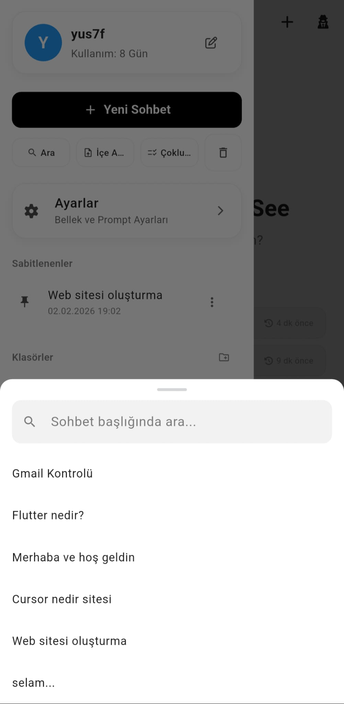
<!-- slide -->
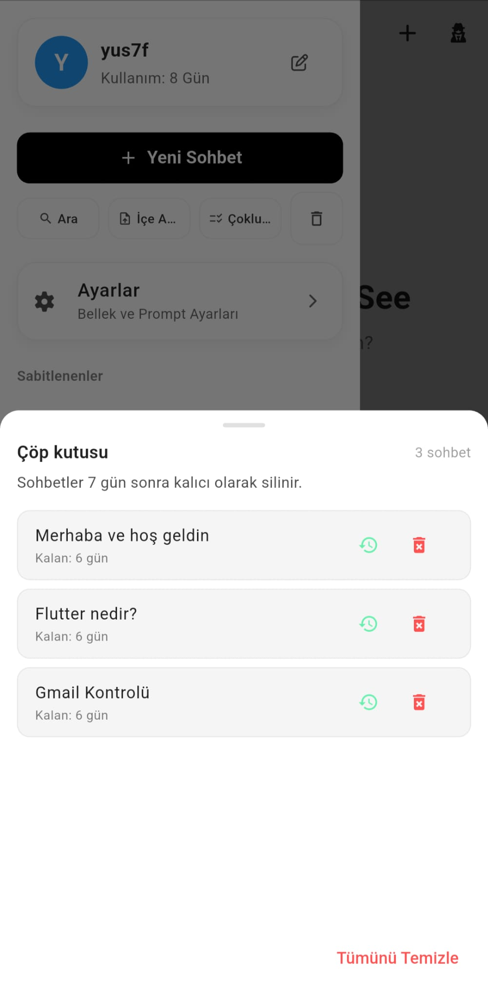
<!-- slide -->
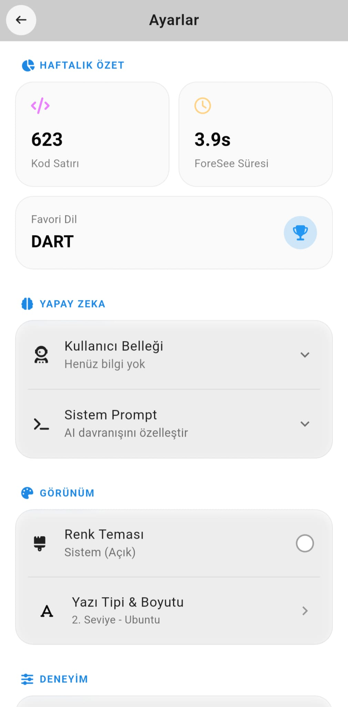
<!-- slide -->
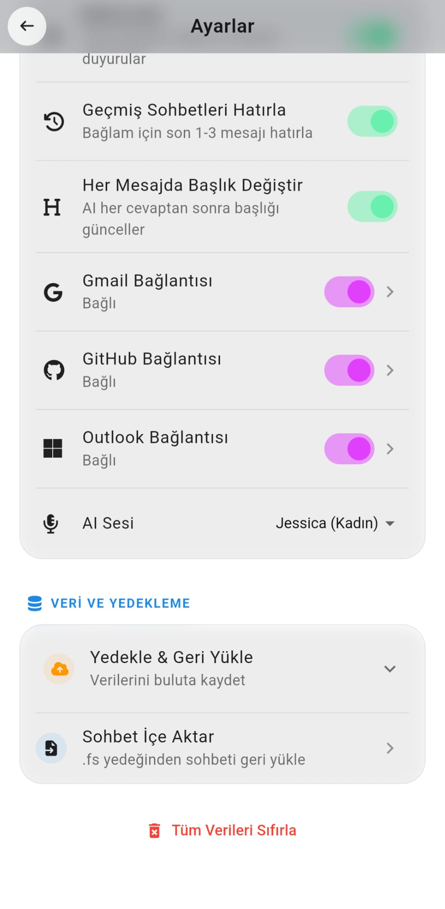
````

## Güvenlik

Bu proje üzerinden paylaşılan kodlarda hiçbir hassas API anahtarı yer almamaktadır. Tüm anahtarlar `.env` üzerinden yönetilmektedir.

## Lisans

Bu proje **MIT Lisansı** ile korunmaktadır. Ancak isim ve logo hakları saklıdır (Bkz: Lisans ve İsimlendirme Uyarısı).

---
*Geliştirici Notu: Clean code odaklı değil, işlev odaklı bir denemedir.*
